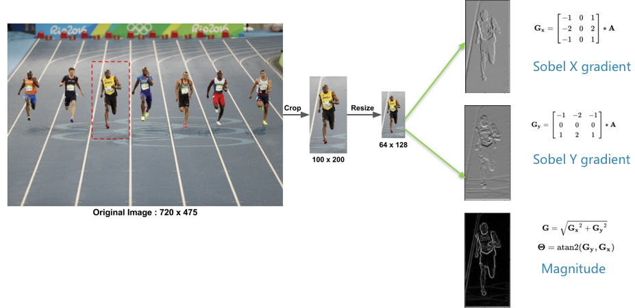
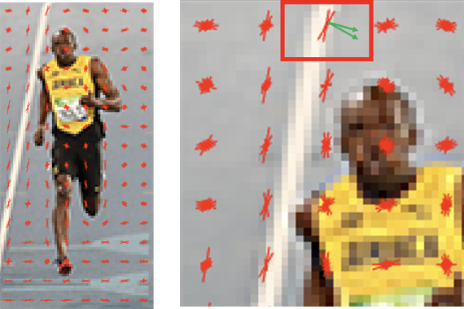

## Harris Corner Kps and Descriptors Extraction

This is Hog Feature extraction for pure numpy

## A feature descriptor

A feature descriptor is a representation of an image or an image patch that simplifies the image by extracting useful information and throwing away extraneous information.

Typically, a feature descriptor converts an image of size width x height x 3 (channels ) to a feature vector / array of length n. In the case of the HOG feature descriptor, the input image is of size 64 x 128 x 3 and the output feature vector is of length 3780.

Keep in mind that HOG descriptor can be calculated for other sizes, but in this post I am sticking to numbers presented in the original paper so you can easily understand the concept with one concrete example.

This all sounds good, but what is “useful” and what is “extraneous” ? To define “useful”, we need to know what is it “useful” for ? Clearly, the feature vector is not useful for the purpose of viewing the image. But, it is very useful for tasks like image recognition and object detection. The feature vector produced by these algorithms when fed into an image classification algorithms like Support Vector Machine (SVM) produce good results.

But, what kinds of “features” are useful for classification tasks ? Let’s discuss this point using an example. Suppose we want to build an object detector that detects buttons of shirts and coats. A button is circular ( may look elliptical in an image ) and usually has a few holes for sewing. You can run an edge detector on the image of a button, and easily tell if it is a button by simply looking at the edge image alone. In this case, edge information is “useful” and color information is not. In addition, the features also need to have discriminative power. For example, good features extracted from an image should be able to tell the difference between buttons and other circular objects like coins and car tires.

In the HOG feature descriptor, the distribution ( histograms ) of directions of gradients ( oriented gradients ) are used as features. Gradients ( x and y derivatives ) of an image are useful because the magnitude of gradients is large around edges and corners ( regions of abrupt intensity changes ) and we know that edges and corners pack in a lot more information about object shape than flat regions.

## Calculate the gradient images

To calculate a HOG descriptor, we need to first calculate the horizontal and vertical gradients; after all, we want to calculate the histogram of gradients. This is easily achieved by filtering the image with the Sobel derivative kernels

We can also achieve the same results, by using Sobel operator in OpenCV with kernel size 1.

Notice, the x-gradient fires on vertical lines and the y-gradient fires on horizontal lines. The magnitude of gradient fires where ever there is a sharp change in intensity. None of them fire when the region is smooth. I have deliberately left out the image showing the direction of gradient because direction shown as an image does not convey much.

The gradient image removed a lot of non-essential information ( e.g. constant colored background ), but highlighted outlines. In other words, you can look at the gradient image and still easily say there is a person in the picture.

At every pixel, the gradient has a magnitude and a direction. For color images, the gradients of the three channels are evaluated ( as shown in the figure above ). The magnitude of gradient at a pixel is the maximum of the magnitude of gradients of the three channels, and the angle is the angle corresponding to the maximum gradient.

## Calculate Histogram of gradients in 8 * 8

In this step, the image is divided into 8×8 cells and a histogram of gradients is calculated for each 8×8 cells.

The contributions of all the pixels in the 8×8 cells are added up to create the 9-bin histogram.

In our representation, the y-axis is 0 degrees. You can see the histogram has a lot of weight near 0 and 180 degrees, which is just another way of saying that in the patch gradients are pointing either up or down.

## Calculate the HOG feature vector

To calculate the final feature vector for the entire image patch, the 36×1 vectors are concatenated into one giant vector. What is the size of this vector ? Let us calculate

How many positions of the 16×16 blocks do we have ? There are 7 horizontal and 15 vertical positions making a total of 7 x 15 = 105 positions.
Each 16×16 block is represented by a 36×1 vector. So when we concatenate them all into one gaint vector we obtain a 36×105 = 3780 dimensional vector.

## Visualizing Histogram of Oriented Gradients

The HOG descriptor of an image patch is usually visualized by plotting the 9×1 normalized histograms in the 8×8 cells. See image on the side. You will notice that dominant direction of the histogram captures the shape of the person, especially around the torso and legs.

